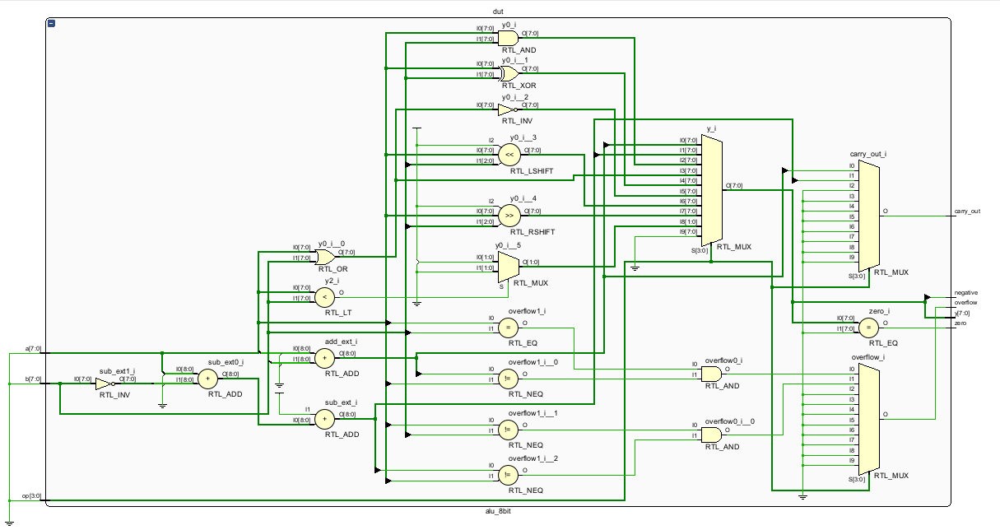
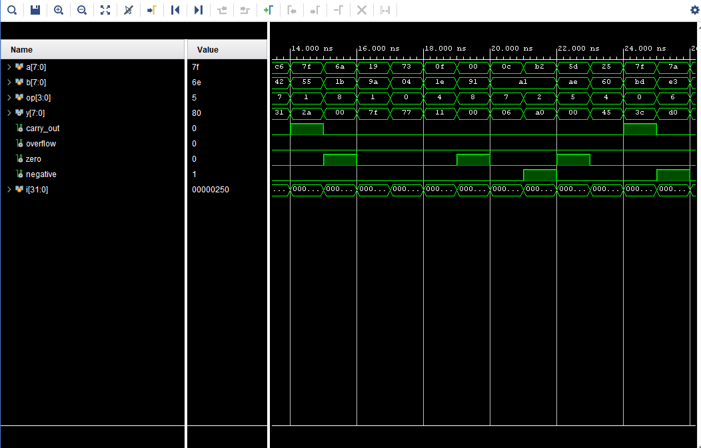

# 🔢 8-bit ALU (Arithmetic Logic Unit) — Verilog + Vivado

A clean **8-bit ALU** implemented in **Verilog**, simulated with **Vivado xsim**, and accompanied by a self-checking testbench.  
---

## ✨ Features

**Operations** (selected by 4-bit `op`):
| Opcode | Name | Behavior |
|-------:|------|----------|
| `0000` | ADD  | `a + b` |
| `0001` | SUB  | `a - b` |
| `0010` | AND  | `a & b` |
| `0011` | OR   | `a | b` |
| `0100` | XOR  | `a ^ b` |
| `0101` | NOR  | `~(a | b)` |
| `0110` | SLL  | Logical left shift: `a << b[2:0]` |
| `0111` | SRL  | Logical right shift: `a >> b[2:0]` |
| `1000` | SLT (signed) | `1` if `$signed(a) < $signed(b)` else `0` |

**Status flags**
- `carry_out` — unsigned carry/borrow indicator (ADD/SUB)
- `overflow` — two’s complement overflow (ADD/SUB)
- `zero` — high when result is `0`
- `negative` — MSB of result (sign bit)

---
**Expected outcome**  
- Passing runs print messages like `All tests PASSED :)` (if the TB is self-checking).  
- On mismatch, the TB should `$fatal` with a clear message (op, inputs, expected vs actual).
---
## 🖼️ RTL Schematic

This is the RTL schematic generated by Vivado (elaborated design):

---
## 🖼️ Waveform

---
## 📜 License

This project is released under the **MIT License**. See [`LICENSE`](LICENSE) for details.

